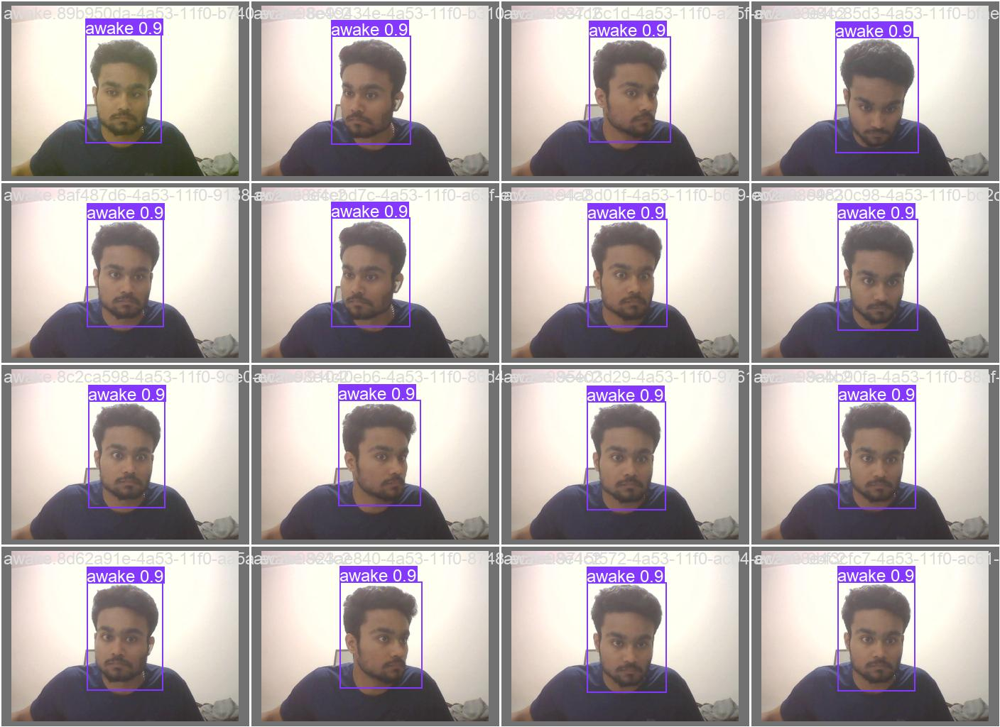
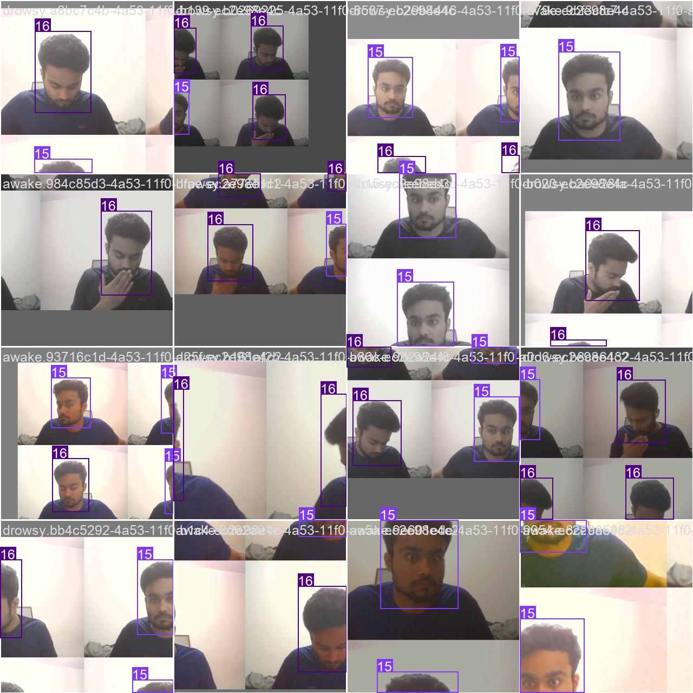

 HEAD

# 💤 Deep Drowsiness Detection using YOLOv5

This project implements a real-time drowsiness detection system using **YOLOv5** and webcam video. The model detects faces and classifies them as **awake** or **drowsy**, with bounding boxes and confidence scores drawn live on-screen.



---

## 📂 Project Structure

```
deep_drowsiness_yolov5/
├── data/
│   ├── images/       # Collected training images
│   └── labels/       # YOLOv5 annotation labels (txt)
├── yolov5/           # YOLOv5 cloned repo (optional if training locally)
├── labelImg/         # Annotation tool (if used)
├── main.py           # Main project code: collection, training, inference
├── yolov5s.pt        # Pretrained YOLOv5 small model (optional)
└── README.md         # You're reading this!
```

---

## 📸 Sample Results

**Awake (confidence: 0.9):**  


**Mixed Awake & Drowsy Samples (live webcam detections):**  


---

## 🔧 Features

- ✅ Real-time face detection using webcam
- ✅ Custom YOLOv5 model trained to detect **"awake"** and **"drowsy"** states
- ✅ Image collection script from webcam
- ✅ Fully annotated and trained using YOLOv5 format
- ✅ Live annotated bounding boxes with class labels and confidence

---

## 🚀 How to Run

> Make sure you have Python and PyTorch installed

### 1. Clone the repository

```bash
git clone https://github.com/yourusername/deep_drowsiness_yolov5.git
cd deep_drowsiness_yolov5
```

### 2. Create virtual environment (optional but recommended)

```bash
python -m venv venv
source venv/bin/activate  # or venv\Scripts\activate on Windows
```

### 3. Install dependencies

```bash
pip install -r requirements.txt
```

### 4. Collect Training Data

```bash
python main.py  # starts data collection (label with keys)
```

### 5. Train YOLOv5 Model

```bash
cd yolov5
python train.py --img 640 --batch 16 --epochs 30 --data data.yaml --weights yolov5s.pt
```

### 6. Run Real-time Detection

```bash
python main.py  # runs live detection
```

---

## 🧠 Model Details

- Architecture: YOLOv5s
- Classes: `awake`, `drowsy`
- Input size: 640x640
- Framework: PyTorch (Ultralytics YOLOv5)

---

## 🛠 Tools Used

- YOLOv5
- OpenCV
- LabelImg (annotations)
- Python + Matplotlib

---

## 📜 License

This project is for educational and research use only.
(Added README, .gitignore, requirements and sample results)
